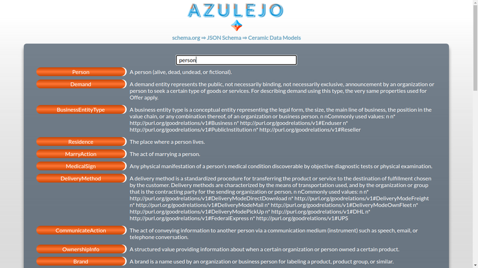
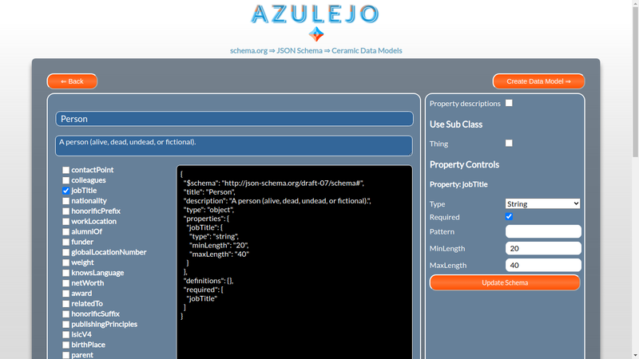
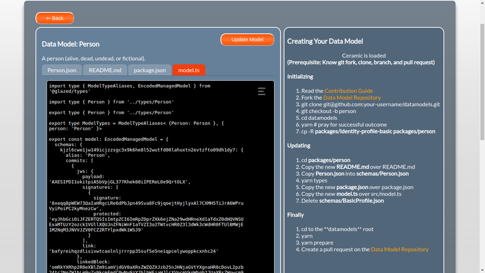

# Using Azulejo

Azulejo is composed of three parts:

1. The *search page* for searching for schemas from schema.org
2. The *schema editor* for editing types and properties of a generated JSON Schema
3. The *model export tool* for generating files for use in Ceramic Data Models

## Search Page

Use the search page to search for schema objects in the Schema.org data set.

Enter text in the search bar and the schema names and descriptions will be searched. Click the button
containing the schema name to use that schema as a base for your Data Model.

## Schema Editor

When a schema has been selected it is converted into a [JSON Schema](https://json-schema.org/) as this is the 
format used by Ceramic Data Models.

You can select and edit the fields you wish to add to your data model.

* Click on the main **Name** and **Description** to edit them for your particular model
* Check **Property descriptions** to add descriptions to the model
* Check one or more **Sub Classes** and their properties will be made available for selection
* Don't forget to click **Update Schema** to apply your property changes to the schema
* Click **Create Data Model** to begin the process of generating a Data Model from the schema

## Model Export

A Ceramic Data Model is an npm package containing files generated from one or more JSON schemas.

The instructions in the side panel explain the process of forking the existing Data Model repository and adding the contents of the files generated by Azulejo.

There are extra things you can do at this point:

* Click on the **SchemaName.json** file to perform manual edits, or to add an externally created JSON schema
* In the **package.json** tab, add the author name, version and tags

When you are happy with the model, click **Update Model**. This will generate a new model.ts that contains the exports that will be pulled into Ceramic applications based on your schema.

Finally, follow the side panel instructions to add the content from the edited files for use in your pull request on the [Ceramic DataModels](https://github.com/ceramicstudio/datamodels) repository.

