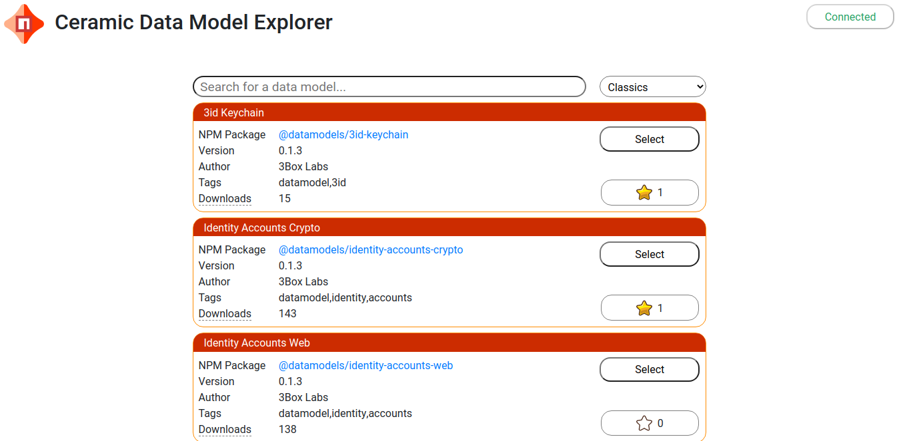
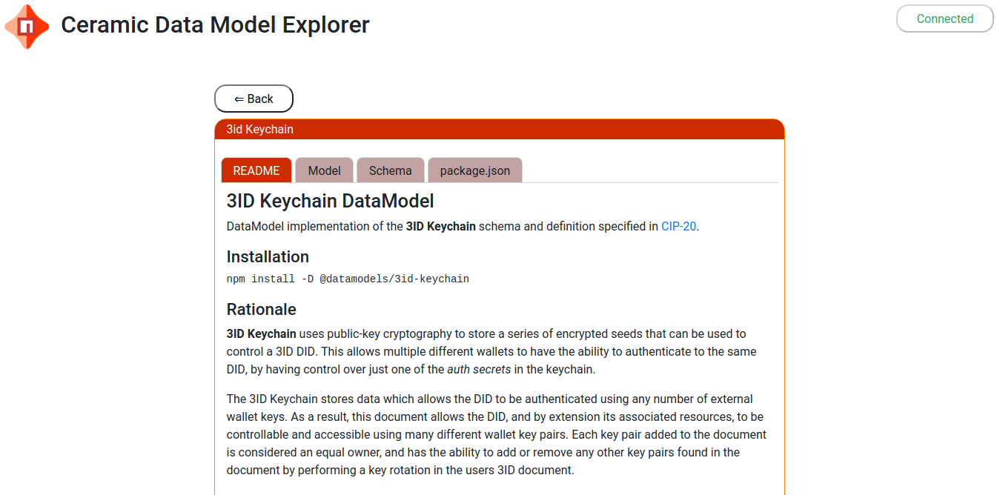
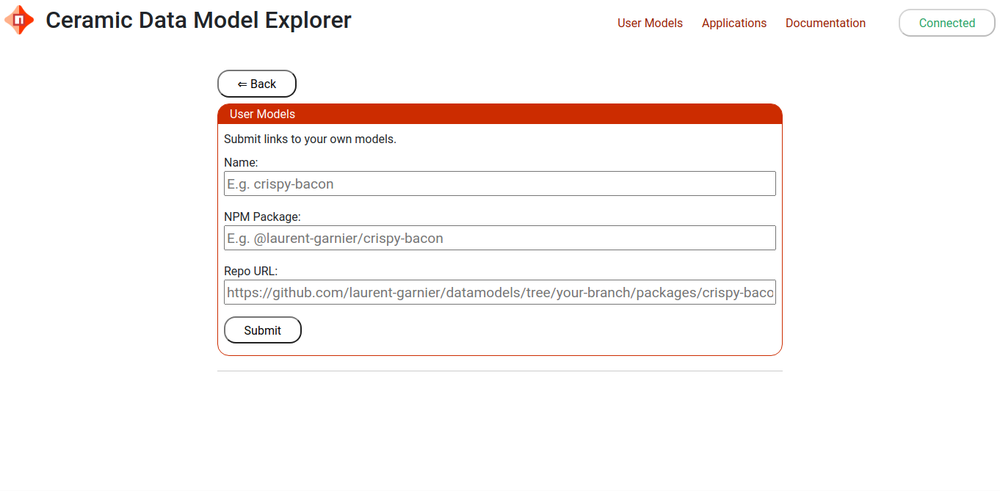
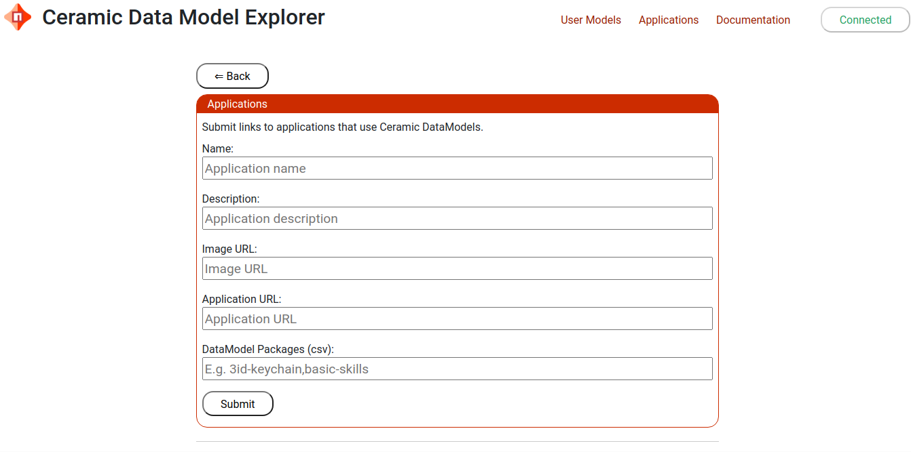

# Using Ceramic Explore 

Ceramic Explore is composed of four parts:

1. The *search page* for searching for DataModels
2. The *data models page* for viewing and interacting with DataModels
3. The *user models page* for submitting your own DataModels
4. The *applications page* for viewing and submitting applications that use a particular DataModel

## Search Page

Use the search page to search for Data Models.

Enter text in the search bar and the schema names and source files will be searched. Click select to view and interact with that DataModel.

A number of Options are provided to help you locate the model that best matches your application.

Click the Star to help others find useful DataModels.

You must be **Connected** to **Ceramic Network** to rate models and add data to **Ceramic Explore**. You need a signer like [MetaMask](https://metamask.io/) to set this up.

## Data Models

A Ceramic Data Model is an npm package containing files generated from one or more JSON schemas.

The Data Models page displays detailed information about the model including it's source files.

If you think improvements could be made to a model, links are provided to make suggestions to the owner of the project.

## User Models

The User Models page is used to add your own unofficial models.

## Applications

The Applications page is used to submit applications that use existing DataModels.

